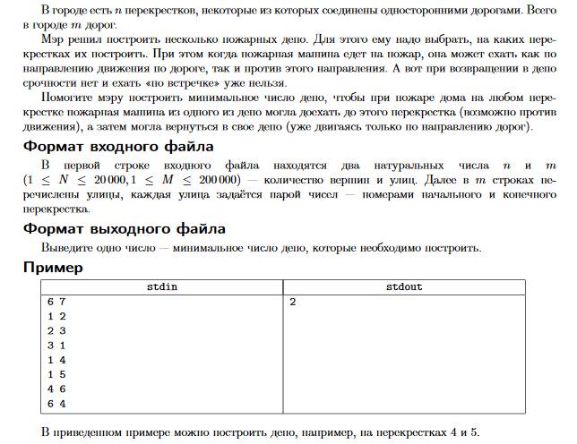

# Olympiad task (Java)
	Solution of the olympiad task in Java language
	
**Task question.** Help the mayor build the minimum number of depots so that in case of a house fire at any crossroad, a fire car from one of the depots can reach this crossroad (possibly against traffic), and then she could return to her depot (already moving only in the direction of the roads). In the first line, n and m (1 ≤ N ≤ 20,000, 1 ≤ M ≤ 200,000) - the number of crossroads and streets. Starting from the second line, there is a listing of the starting and ending street numbers. Need to print a number showing the minimum number of depot to be built.

**Short description of the task solution.**
First we need to find SCC (Strongly Connected Components), in the program it was implemented by Kosaraju algorithm. After that, we need to check connections between SCC: if we can reach a vertex located in one SCC from vertex located in another SCC, we add the vertex we reached in preliminary list of depot. In case we can't reach both of vertices, we add both vertices in preliminary list of depot. And the last action is to check reachability between vertices in preliminary list of depot. If we can reach from one to another, we delete the vertex from which we left, and the final list will be list of depot.

**Working input data examples:**    
**Example 1.**  
Number of vertices (crossroads): 6  
 Number of edges (roads): 7  
 Connections of vertices:  
 1 5  
 1 4  
 1 2  
 2 3  
 3 1  
 4 6  
 6 4    

 **Example 2.**  
 Number of vertices (crossroads): 8  
 Number of edges (roads): 13  
 Connections of vertices:  
 1 2  
 2 3  
 3 4  
 4 3  
 4 8  
 8 4  
 8 7  
 7 6  
 6 7  
 3 7  
 5 1  
 5 6  
 2 5   

> WARNING: the program may not work correctly with different parameters.
__________

# Олимпиадная задача (Java)
	Решение олимпиадной задачи по программированию на языке Java
	

**Краткое описание решения задачи:**
Для начала нам нужно найти КСС (Компоненты Сильной Связи), в программе это реализовано через алгоритм Косараджу. После этого нам нужно проверить связи между КСС: если мы можем достичь вершину, расположенную в одной КСС из вершины, расположенной в другой КСС, мы добавляем достигнутую вершину в предварительный список депо. Если мы не можем достичь обеих вершин друг из друга, мы добавляем обе вершины в предварительный список депо. И последнее действие - проверить достижимость между вершинами в предварительном списке депо. Если мы можем достичь одну вершину из другой, мы удаляем вершину из которой мы вышли. Окончательный список будет списком депо.

 **Рабочие примеры входных данных:**    
 **Пример 1.**  
 Количество вершин (перекрестков): 6  
 Количество ребер (дорог): 7  
 Связи между вершинами:  
 1 5  
 1 4  
 1 2  
 2 3  
 3 1  
 4 6  
 6 4    

**Пример 2.**   
Количество вершин (перекрестков): 8  
 Количество ребер (дорог): 13  
 Связи между вершинами:  
 1 2  
 2 3  
 3 4  
 4 3  
 4 8  
 8 4  
 8 7  
 7 6  
 6 7  
 3 7  
 5 1  
 5 6  
 2 5   

> ВНИМАНИЕ: с другими параметрами программа может работать некорректно.
__________
kenthex @ 2020
